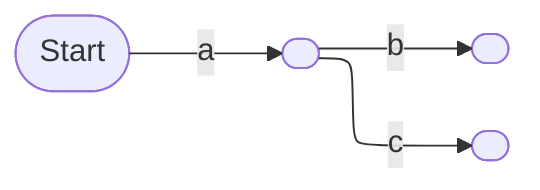
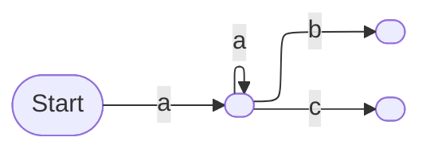
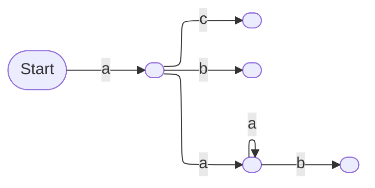

# Pattern Guide

Patterns are contained in yaml files. The top level keys are:

- [patterns](#patterns)
- [languages](#languages)
- [transform](#transform)
- [out](#out)
- [name](#name)
- [group](#group)

# Patterns

LexerSearch patterns resemble the language being scanned. For example, `=` stated in a pattern will
match `=` stated in the source code.

Basic canonicalization is performed before pattern matching:

- comments are removed
- unnecessary whitespace is removed
- quotation types (`''` vs `""`) are treated as the same
- adjacent string literals are concatenated

Aside from those exceptions, a different pattern is required for each equivalent
way that code can be written.

```rust
let x = 0;
something(x); // DIFFERENT
something(0); // DIFFERENT
```

## Captures

Captures come in one of three forms, only matching a single lexer token and only
the appropriate type of lexer token:

- `&IDENTIFIER`,     matching variables (e.g. `_my_variable_123`) or numbers (`[0-9]+`)
- `$STRING_LITERAL`, e.g. `"hello world"`

The first time a capture is stated in a pattern is the creation of the capture.
Subsequent mentions of that same capture act as a back-reference to the initial
capture.

> [!WARNING]  
> yaml interprets some characters in a special way, which may lead to unexpected
> results. For example, yaml anchors use the characters `&` and `*`. This
> usually is highlighted in your editor of choice, but when in doubt, consider
> containing the value in `""` quotes or use `|` or `>` multi-line scalar
> values.

> [!IMPORTANT]  
> Although `&ABC`, and `$ABC`, are unrelated captures, only the
> capture's name ("ABC") populates the output. In these clashing cases, the last
> capture will be the one that appears in the output. Try to avoid this case.

> [!TIP]  
> - A capture name prefixed by `_` is suppressed from the output but will still
>   be used by the [transform](#transform). e.g. `$_ABC`.
> - The prefix character can be escaped via whitespace. e.g. `& ABC` matches the
>   literals `&` then `ABC`.
> - Capture names should be short and UPPERCASE.

## Ellipsis Operators

The ellipsis operators match zero or more lexer tokens. For example: `test(...)`
matches `test(1, 2, 3)`.

Ellipsis operators can be declared inside brackets or outside brackets. Here's
the ways they can be declared inside brackets: `(...)`, `[...]`, `{...}`, or `<
..> >`. LexerSearch doesn't parse. This leads to ambiguity regarding corner
brackets. `>` could represent a "greater than" comparison, or it could represent
the closing of a template argument list in languages like Rust or C++, e.g.
`vector<int>`. LexerSearch's pattern language has the author resolve the
ambiguity, like: `vector< ..> >`. The `..>` is the corner bracket ellipsis. This
indicates that the ellipsis operator is contained inside corner brackets. It is
deduced for other types of brackets.

### Not Too Short

When declared in brackets, the ellipsis operators match from an open bracket to
the corresponding close bracket. This better handles nested brackets. For
example rule `test(...)`:

```c
// don't stop early at first ')'
//        V
   test( (), y, () )
```

### Not Too Long

When declared in brackets they can't escape out of the bracket scope. For the
example rule `test(...)`:

```c
// first match ends where it should
//             V
   test(1, 2, 3); test(4, 5, 6);
//                            ^
// and doesn't continue to here
```

#### Scope Blocking

The scope blocking ellipsis ensures that variable declaration aren't accessible
in the parent lexical scope. It allows the "not too long" rule to apply to
lexical curly brackets:

```
let &VAR = &NUM;
..}
test(&VAR);
```

```rust
let x = 123; // yes!
{
  let x = 456; // no!
}
test(x);
```

The scope blocking ellipsis stores the change in depth from the previous scope
blocking ellipsis. In this example, both `b` and `c` have to be in scope of `a`:

```
a ..} b ..} c
```

```rust
a
{ // +1 depth. stored for next ..}
  b
} // -1 depth. sum of zero; ..} allows it
c
```

However this flow of information is blocked by ellipsis not contained in
brackets, e.g. `a ..} b ... c ..} d`.

#### Statement Blocking

This is intended for emulating the source-sink functionality seen in other SAST
scanners. The following example detects when a variable is assigned to something
which involves the number 5.

```
&NUM = ..? 5 ..? ;
```

The `..?` operator is very similar to the scope blocking ellipsis, but it will
not exit the current statement. Its state is reset when reaching `...` or `..}`,
(which are both intended to be used between statements).

## Repetitions

Looping is provided via the `..*` operator. For example:

```
#[test]
..* #[...] ..*
fn &NAME(...) {...}
```

The section surround by `..*` is matched zero or more times. If a repitition
section contains the creation of captures then those captures cannot be
reference anywhere - they are forgotten when exiting the repitition section, and
they cannot be backreferenced within the repitition section (it's instead
treated as the creation of a different independent capture).

## Set Start

The `..^` operator overwrites the start of the match's span. For example
pattern:

```
import abc
... ..^ abc.something(...)
```

```py
import abc
# match span starts at 'abc' and not the 'import' above
abc.something(123)
```

## Embed Patterns

LexerSearch has a feature flag to embed your scan patterns into the output binary.
By default this is disabled and the patterns are passed via cli.

```bash
$ cargo run -- <PATTERNS_PATH> <SCAN_PATH> # DEFAULT
$ LEXERSEARCH_EMBED_PATTERNS=<PATTERNS_PATH> cargo run --features=embed-patterns -- <SCAN_PATH>
```

## Pattern Conflict

When multiple LexerSearch patterns are run at the same time they can conflict
with each other.

LexerSearch is based off of a trie-like data structure. For example, the two patterns `a b` and `a c` are combined together like so:



Suppose a loop is introduced, `a ..+ a ..+ b` and `a c`. This constructs:



Since the structure is shared, input `a a c` can match despite not being
match-able by each pattern individually.

### Theory

There are two ways of solving this problem. One way constructs the structure so
that any loop forms its own branch - one follows the path that avoids the loop
(uses it 0 times), and the other is formed when the loop is used (1 or more
times). The above example would form:



The problem with this approach is that each loop in a pattern duplicates the
number of branches needed to form the structure (2^n). This is untenable for
longer patterns.

The other solution uses the original structure but has each partial match store
traversal information. When a loop is used, the partial match gets marked
accordingly. At the possible full match, the partial match is only accepted if
it used an appropriate traversal to get there. However this moves the problem to
runtime, the number of partial matches would explode as the input is processed.

Aside from managing pattern conflicts, detection is also not known to be possible in a reasonable time complexity while avoiding false positive and negatives.

### Practice

In practice, scanning source code is less ambiguous than these examples and
there are ways of managing cases if they arise (which they should not).

#### Repitition

The repitition feature was created with a constrained use case in mind: function
and method annotation in languages like java or rust. In these cases, there is
always some preamble, and following that _very specific_ context, the repitition
is used just to consume sections until the desired part is arrived at. Because
repititions are used in specific context, there shouldn't ever be cases where
they clash.

```
#[test] // annotation
..* #[...] ..* // multiple times
fn &_F(...) {...} // fn
```

#### Set Start

Setting the start of a match via `..^` sets a flag on the transition in the
structure. This is applied with a OR ASSIGN, so it could affect multiple
patterns, e.g. `abc ..^ 123` and `abc 123`.

The start should be set in a consistent way and it should happen at later parts
of a pattern which are gated by sufficient context.

#### Ellipsis Operators

Pattern `vector< ..> >` searches for a vector declared with a template argument
list. `vector< ... >` searches for "vector" literal, less than, some tokens,
then greater than. Both patterns can't be used together since this gives
ambiguity on which reflexive transition a partial match followed, and because
this ambiguity is arrived at by the same pattern prefix. For the ellipsis
operator there's generally only one correct choice (in this case, the former is
likely what was intended).

# Languages

This field indicates what languages the patterns should apply to. For the
language support list, please refer to [here](./src/io/mod.rs).

## Python-like

Most python-like rules should be written like this:

```yaml
patterns: # EITHER OR
  - >
    &VAR=&ABC
    ...
    something(... kwar=&VAR ... )
  - "&VAR=&ABC...something(... kwar=&VAR ... )"
languages:
  - py
name: name
```

instead of this:

```yaml
patterns: # BAD
  - |
    &VAR=&ABC
    ...
    something(... kwar=&VAR ... )
languages:
  - py
name: name
```

Python-like languages are sensitive to line breaks. In the latter example, at
least one line of space is required between the two statements for a match. This
is likely not what was intended.

# Transform

Transform applies after a pattern is completely matched and associate the
capture's name (e.g. name "ABC" for capture "$ABC") with a
[regex](https://docs.rs/regex-lite/latest/regex_lite/#syntax). If the capture's
content does not match the expression then the match is discarded.

If the regex matches "named capture groups" (like `(?<ALG>.+)`) then they will
populate the output. If the named capture group's name matches the capture's
name then the matched values must be equal to accept a match. In this example
the match is accepted because both contain "x":

```rust
let x = "hi";
println!("{x}");
```

```yaml
patterns:
  - >
    &_VAR = $_STR;
    ..}
    println!($_FMT)
languages:
  - rust
name: fmt_test_example
out:
  literal_key: literal_value
transform:
  _FMT: ^\{(?<_VAR>[^}]+)}$

```

> [!IMPORTANT]  
> `transform` has the second highest priority, behind `out`, and will overwrite
> captures if the keys clash.

> [!TIP]  
> Named capture groups starting with `_` are suppressed from the output.

# Out

A pattern match provides output fields like the position of the match and
captures. `out` provides a mechanism which allows the author to state literal
output values which are otherwise not producible from the matched snippet.

> [!IMPORTANT]  
> `out` has the highest priority, and will overwrite captures if the keys clash.

> [!TIP]  
> By convention, if the captures contains "ignore": "true", then the entire
> result should be discarded. When paired with groups (below), this subtly
> allows for patterns which are not contained in other patterns.

# Name

The name field is used to identify which pattern a match is from. The
combination of the name and [group](#group) should be unique for each pattern.

```yaml
patterns:
  - $_STR # match any string
name: my_reasonably_unique_name_here
languages:
  - py
```

```yaml
{..., "name":"my_reasonably_unique_name_here", ...} # output
```

# Group

A pattern may opt in to grouping by stating a non empty group. Suppose the
following code is being matched:

```java
String v = "RSA";
KeyPairGenerator kpg = KeyPairGenerator.getInstance(v);
kpg.initialize(1024);
```

A single pattern can match this whole sequence and extract the algorithm name
and key size. However, any part of the sequence may be unavailable or not identified.

```java
String v = "RSA";
KeyPairGenerator kpg = KeyPairGenerator.getInstance(v);
kpg.initialize(Integer.parseInt("1024")); // not handled
```

One workaround would be to state several different rules; one matches all the
available parts, and the others match fewer parts, etc. This would create
duplicate results.

Another workaround would be to create different rules which only match against a
single part of interest. But this produces unrelated matches which are less
useful than when they are known to apply together. The solution to this is to
use a group:

```yaml
patterns: # "anchor" pattern
  - >
    &_VAR = KeyPairGenerator.getInstance(&_ARG ...)
languages:
  - java
group: java_key
name: anchor
```
```yaml
patterns: # key size from anchor
  - >
    &_VAR = KeyPairGenerator.getInstance(&_ARG ...)
    ..}
    &_VAR.initialize(&KEY_SIZE)
languages:
  - java
group: java_key
transform:
  KEY_SIZE: ^[0-9]
name: unique_key_size
```
```yaml
patterns: # alg name from anchor
  - >
    String &_VAR = $ALG;
    ..}
    KeyPairGenerator.getInstance(&_VAR ...)
languages:
  - java
name: alg
group: java_key
```

The above rules together produce a single match:

```yaml
{
    ...
    "name": "java_key",
    "captures": {
        "ALG": "RSA",
        "KEY_SIZE": "1024"
    }
}
```

The matches are merged into the same finding when:
- the user stated group is the same
- between the incoming match and the intersection of the matches already in the
  finding, the span of one must cover the other

This on its own is not enough to prevent merging of unrelated matches, as there
could be overlapping matches with patterns of unrelated variables. If the name
of a capture starts with "SAME" or "_SAME" then the capture name and value must
match in the finding for them to be merged.

By default, if a match being merged has the same name as an existing match, then
the new match replaces the old match, and the old match is discarded. This
better models cases like variable redeclaration / shadowing. However, if the
rule starts with "unique", then this instead forks the finding - both are sent
to the output.

# Examples

See the [examples](./examples/) folder for more details!
